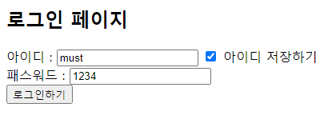
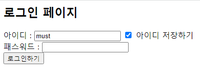
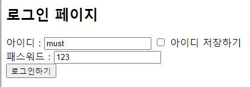

# 쿠키(Cookie)

# 쿠키란?

- 쿠키는 클라이언트의 상태 정보를 유지하기 위한 기술.
- 상태 정보를 클라이언트(주로 웹 브라우저)에 키와 값 형태로 저장했다가 다음 요청 시 저장된 쿠키를 함께 전송함.
- 웹 서버는 브라우저가 전송한 쿠키로부터 필요한 데이터를 읽어올 수 있음.
- 쿠키 표준에 명시된 제약
    - 3000개까지 만들 수 있음.
    - 쿠키 하나의 초대 크기는 4096바이트. 4KB.
    - 하나의 호스트나 도메인에서 최대 50개까지 만들 수 있음.
- 쿠키로 저장할 수 있는 최대 용량은 대략 1.2MB.

# 기본 동작 확인

## 동작 메커니즘

1. 클라이언트가 서버에 요청을 보냄.
2. 서버가 쿠키를 생성하여 HTTP 응답 헤더에 실어 클라이언트에 전송함.
3. 클라이언트는 쿠키를 받아 저장함. (이 시점에는 쿠키가 클라이언트에만 저장된 상태이므로 서버는 아직 쿠키를 사용할 수 없음)
4. 클라이언트는 다음 번 요청 시 저장해둔 쿠키를 HTTP 요청 헤더에 실어 보냄.
5. 서버는 쿠키의 정보를 읽어 필요한 작업을 수행함.
- 페이지를 새로 고치거나 다시 접속해야 서버가 쿠키를 읽어 활용하게 됨.

## 속성과 API

- 쿠키를 구성하는 속성
    - 이름 : 쿠키를 구별하는 이름
    - 값 : 쿠키에 저장할 실제 데이터
    - 도메인 : 쿠키를 적용할 도메인
    - 경로 : 쿠키를 적용할 경로
    - 유지 기간 : 쿠키를 유지할 기간
- 쿠키 설정 메소드

- `void setValue(String value)` : 쿠키 값 설정. 쉼표나 세미콜론 같은 문자는 포함할 수 없음.
- `void setDomain(String domain)` : 쿠키에 적용할 도메인을 설정함.
    - 주 도메인만 적용하고 싶다면 "도메인" 형태로 기술.
    - 서브 도메인에도 적용하고 싶다면 ".도메인" 형태로 기술.
    - 도메인은 www. mail. blog. 을 말함.
- `void setPath(String path)` : 쿠키가 적용될 경로를 지정함. 지정한 경로와 그 하위 경로에까지 적용됨.
- `void setMaxAge(int expire_seconds)` : 쿠키가 유지될 기간을 초 단위로 설정함. 기간을 설정하지 않으면 웹 브라우저가 닫힐 때 쿠키도 같이 삭제됨.
- `Cookie 이름 = new Cookie(String name, String value)` : 이름과 값을 받아 새로운 쿠키를 생성함.
    - 쿠키의 이름은 생성자를 통해 설정하고, 생성 후에는 더 이상 이름을 변경할 수 없음.
- 쿠키 정보를 읽는 메소드
    - `String getName()` : 쿠키 이름 반환
    - `String getValue()` : 쿠키 값 반환
    - `String getDomain()` : 쿠키가 적용되는 도메인 반환
    - `String getPath()` : 쿠키 적용 경로 반환. setPath() 설정한 적 없으면 null 반환.
    - `int getMaxAge()` : 쿠키 유지 기간 반환. setMaxAge() 설정한 적 없으면 -1 반환.

## 기본 조작법

```java
<%@ page language="java" contentType="text/html; charset=UTF-8"
    pageEncoding="UTF-8"%>
<html>
<head><title>Cookie</title></head>
<body>
    <h2>1. 쿠키(Cookie) 설정</h2>
    <%
    Cookie cookie = new Cookie("myCookie", "쿠키맛나요");  // 쿠키 생성
    cookie.setPath(request.getContextPath());  // 경로를 컨텍스트 루트로 설정
    cookie.setMaxAge(3600);  // 유지 기간을 1시간으로 설정
    response.addCookie(cookie);  // 응답 헤더에 쿠키 추가
    %>

    <h2>2. 쿠키 설정 직후 쿠키값 확인하기</h2>
    <%
    Cookie[] cookies = request.getCookies();  // 요청 헤더의 모든 쿠키 얻기
    if (cookies!=null) {
        for (Cookie c : cookies) {  // 쿠키 각각의
            String cookieName = c.getName();  // 쿠키 이름 얻기
            String cookieValue = c.getValue();  // 쿠키 값 얻기
            // 화면에 출력
            out.println(String.format("%s : %s<br/>", cookieName, cookieValue));
        }
    }
    %>

    <h2>3. 페이지 이동 후 쿠키값 확인하기</h2>
    <a href="CookieResult.jsp">
        다음 페이지에서 쿠키값 확인하기
    </a>
</body>
</html>
```

`cookie.setPath(request.getContextPath());`

설정한 경로는 request 내장 객체의 getContextPath()로 얻어온 컨텍스트 루트임. 이클립스에서는 프로젝트명이 컨텍스트 루트로 사용됨. "/MustHaveJSP_origin" 반환되어 설정됨. 웹 어플리케이션 전체에서 쿠키를 사용하겠다는 의미임.

이 페이지를 최초로 실행하면 "myCookie"는 보이지 않음. 쿠키는 생성 직후에는 사용할 수 없음.

쿠키는 서버에서 먼저 생성한 후 응답 헤더를 통해 클라이언트로 전송함. 이때 서버는 클라이언트의 요청에 의해 단지 쿠키를 만들기만 할 뿐 그 내용을 즉시 읽을 수는 없음. 클라이언트로부터 재요청이 들어올 때 요청 헤더를 통해 쿠키가 서버로 전송되는데 이때부터 내용을 읽을 수 있음.

최초 실행 결과에는 생성한 적이 없는 JSESSIONID라는 쿠키가 보임. 이 쿠키는 톰캣 컨테이너에서 세션을 유지하기 위해 발급하는 키로, 새로운 웹 브라우저를 열면 자동으로 생성됨.

```html
<!-- 쿠키값 확인. CookieResult.jsp -->
<%@ page language="java" contentType="text/html; charset=UTF-8"
    pageEncoding="UTF-8"%>
<!DOCTYPE html>
<html>
<head>
<meta charset="UTF-8">
<title>CookieResult.jsp</title>
</head>
<body>
    <h2>쿠키값 확인하기(쿠키가 생성된 이후의 페이지)</h2>
    <%
    Cookie[] cookies = request.getCookies();
    if (cookies != null) {
        for (int i = 0; i < cookies.length; i++) {
            String cookieName = cookies[i].getName();
            String cookieValue = cookies[i].getValue();
            out.println(String.format("쿠키명 : %s - 쿠키값 : %s<br/>",
                                      cookieName, cookieValue));
        }
    }
    %>
</body>
</html>

```

"CookieResult.jsp"를 실행하면 "myCookie"값을 바로 볼 수 있음.

앞에서 "CookieMain.jsp"를 실행했을 때 클라이언트(웹 브라우저)는 서버로부터 쿠키를 받아 저장해 두었으며, "CookieResult.jsp"를 실행하면 이 쿠키를 요청 헤더에 담아 서버로 전송함. 그 결과 서버는 쿠키를 읽어 출력할 수 있게 됨.

이 시점 이후부터는 "CookieMain.jsp"를 실행하더라도 myCookie 값이 출력됨.

이 쿠키는 setMaxAge()로 설정한 1시간 동안은 웹 애플리케이션 전체에서 사용할 수 있음.

쿠키를 삭제할 때는 쿠키를 빈 값으로 설정하고 유지 기간을 0으로 부여하면 됨.

# 레이어 팝업창 제어(응용)

웹 애플리케이션 개발할 때 팝업창 많이 사용함. 회원가입 시 아이디 중복 체크나 간단한 공지사항을 띄워주는 용도로 활용.

과거에는 별도의 URL을 가지는 팝업창을 주로 사용하였으나 불법 광고를 홍보하는 데 많이 악용되어 최근에는 레이어를 이요한 형태의 팝업을 주로 사용함.

## 쿠키 없이 기본 기능 구현하기

```java
<%@ page language="java" contentType="text/html; charset=UTF-8"
    pageEncoding="UTF-8"%>
<%
String popupMode = "on";
%>
<!DOCTYPE html>
<html>
<head>
<meta charset="UTF-8">
<title>쿠키를 이용한 팝업 관리 ver 0.1</title>
<style>
    div#popup {
        position: absolute; top:100px; left:50px; color:yellow;
        width:270px; height:100px; background-color:gray;
    }
    div#popup>div {
        position: relative; background-color:#ffffff; top:0px;
        border:1px solid gray; padding:10px; color:black;
    }
</style>

<script src="<https://ajax.googleapis.com/ajax/libs/jquery/3.5.1/jquery.min.js>"></script>
<script>
$(function() {
    $('#closeBtn').click(function() {
        $('#popup').hide();
    });
});
</script>
</head>
<body>
<h2>팝업 메인 페이지(ver 0.1)</h2>
<%
    for (int i = 1 ; i <= 10 ; i++) {
        out.print("현재 팝업창은 " + popupMode + " 상태입니다.<br/>");
    }

    if (popupMode.equals("on")) {
%>
    <div id="popup">
        <h2 align="center">공지사항 팝업입니다.</h2>
        <div align="right"><form name="popFrm">
            <input type="checkbox" id="inactiveToday" value="1" />
            하루 동안 열지 않음
            <input type="button" value="닫기" id="closeBtn" />
        </form></div>
    </div>
<%
    }
%>
</body>
</html>

```

`String popupMode = "on";`

popupMode는 레이어 팝업창을 띄울지를 알려주는 변수. 이 값이 "on"이면 39 라인에서 팝업창을 보여주게 처리함.

`$(function() {`
    `$('#closeBtn').click(function() {`
        `$('#popup').hide();`
    `});`

jQuery를 이용하는 자바스크립트 코드. id가 closeBtn인 요소(닫기 버튼)를 클릭하면 실행되는 함수로, hide()를 사용하여 팝업창을 숨김 처리함.

쿠키가 없는 기본 뼈대 소스 코드임. 아직 쿠키를 통한 상태 관리가 되지 않기 때문에 [하루 동안 열지 않음] 체크박스를 체크해도 아무런 효과가 없음.

## 쿠키를 이용해 상태 정보 유지하기

```java
<%@ page language="java" contentType="text/html; charset=UTF-8"
    pageEncoding="UTF-8"%>
<%
String popupMode = "on";

[Cookie[] cookies = request.getCookies();
if (cookies != null) {
    for (Cookie c : cookies) {
        String cookieName = c.getName();
        String cookieValue = c.getValue();
        if (cookieName.equals("PopupClose")) {
            popupMode = cookieValue;
        }
    }
}](https://www.notion.so/Cookie-3abbfbcfb6a040d4b9c975e8c66bc661)
%>
<!DOCTYPE html>
<html>
<head>
<meta charset="UTF-8">
<title>쿠키를 이용한 팝업 관리</title>
<style>
    div#popup{
        position: absolute; top:100px; left:100px; color:yellow;
        width:300px; height:100px; background-color:gray;
    }
    div#popup>div{
        position: relative; background-color:#ffffff; top:0px;
        border:1px solid gray; padding:10px; color:black;
    }
</style>

<script src="<https://ajax.googleapis.com/ajax/libs/jquery/3.5.1/jquery.min.js>"></script>
<script>
$(function() {
    $('#closeBtn').click(function() {
        $('#popup').hide();
        var chkVal = $("input:checkbox[id=inactiveToday]:checked").val();
        $.ajax({
            url : './PopupCookie.jsp',
            type : 'get',
            data : {inactiveToday : chkVal},
            dataType : "text",
            success : function(resData) {
                if (resData != '') location.reload();
            }
        });
    });
});
</script>
</head>
<body>
<h2>팝업 메인 페이지</h2>
<%
    for (int i = 1; i <= 10; i++) {
        out.print("현재 팝업창은 " + popupMode + " 상태입니다.<br/>");
    }
    if (popupMode.equals("on")) {
%>
    <div id="popup">
        <h2 align="center">공지사항 팝업입니다.</h2>
        <div align="right"><form name="popFrm">
            <input type="checkbox" id="inactiveToday" value="1" />
            하루 동안 열지 않음
            <input type="button" value="닫기" id="closeBtn" />
        </form></div>
    </div>
<%
    }
%>
</body>
</html>

```

쿠키를 읽어 이름이 "PopupClose"인 쿠키가 존재하면 popupMode 변수의 값을 쿠키의 값으로 갱신함. 어딘가에서 PopupClose 쿠키의 값을 "on"이 아닌 값으로 설정했다면 팝업창이 더는 뜨지 않음.

팝업창을 숨김 처리하는 데서 끝나지 않고 [하루 동안 열지 않음]을 체크했는지를 확인하여 쿠키를 설정하는 페이지인 PopupCookie.jsp를 실행함.

`var chkVal = $("input:checkbox[id=inactiveToday]:checked").val();`

id가 "inactiveToday"이면서 'checked 체크된' 체크박스의 값을 .val() 로 읽어와서 chkVal 변수에 저장한다는 뜻. [하루 동안 열지 않음] 체크박스를 체크하면 chkVal 변수에 "1"이 저장되고, 체크하지 않으면 아무 값도 저장되지 않음.

ajax()는 비동기 HTTP 요청을 보내는 jQuery 함수임. 인수로는 HTTP 요청을 구성하는 다양한 설정값을 받게 됨. 위의 소스코드에서 사용한 설정들은

- url : 요청을 보낼 페이지의 URL. 기본값은 현재 페이지.
- type : 'get', 'post' 등 HTTP 메소드를 지정함.
- data : 서버로 보낼 데이터.
- dataType : 서버로부터 받을 '응답' 데이터의 타입.
- success : 요청 성공 시 실행할 콜백 함수.

ajax() 함수 해석

- `$.ajax` : 비동기로 요청을 보냄.
- `url : './PopupCookie.jsp',` : PopupCookie.jsp 파일
- `type : 'get',` : HTTP GET 방식
- `data : {inactiveToday : chkVal},` : inactiveToday=<chkVal 변수의 값> 데이터
- `dataType : "text"` : 응답 데이터의 타입은 일반 텍스트
- `sucess : function(resData)` : 요청 성공시.
- `if (resData != '')` : 응답 데이터가 있다면
- `location.reload();` : 페이지를 새로고침.

```java
<%@ page language="java" contentType="text/html; charset=UTF-8"
    pageEncoding="UTF-8" trimDirectiveWhitespaces="true"%>
<%
String chkVal = request.getParameter("inactiveToday");

if (chkVal != null && chkVal.equals("1")) {
    Cookie cookie = new Cookie("PopupClose", "off");  // 쿠키 생성
    cookie.setPath(request.getContextPath());  // 경로 설정
    cookie.setMaxAge(60*60*24);  // 유지 기간 설정
    response.addCookie(cookie);  // 응답 객체에 생성한 쿠키 추가
    out.println("쿠키 : 하루 동안 열지 않음");
}
%>
```

체크박스 폼값을 받음. [오늘 하루 열지 않음] 체크박스를 체크했다면 이 값으로 "1"이 전달됨.

값이 "1"이면 이름이 "PopupClose", 값이 "off", 경로는 컨텍스트 루트, 유지 기간은 하루인 쿠키를 생성해 응답 객체에 추가함.

출력하는 문자열은 "PopupMain.jsp"의 ajx() success의 요청 성공시 호출되는 함수로 콜백됨.

시간 흐름 순으로 정리

1. 폼 체크하고 닫기 버튼 클릭
2. 팝업창 hide됨.
3. chkVal 변수에 id가 inactiveToday이고 checked된 체크박스의 value인 "1"을 저장함.
4. ajax() 함수 실행함.
5. 이름 inactiveToday 값 "1" 쌍을 GET 방식으로 PopupCookie.jsp로 보냄
6. PopupCookie.jsp에서 request.getParameter로 inactiveToday 값을 읽어서 chkVal 변수에 저장함.
7. chkVal 값이 null이 아니고 "1"이면 이름이 PopupClose이고 값이 "off"인 쿠키 생성함.
8. response.addCookie(cookie) 로 HTTP 응답 헤더에 실어 클라이언트로 쿠키를 전송함.
9. 클라이언트 쿠키 받아 request 객체에 저장함.
10. ajax() 함수 success 되어 페이지 reload 실행됨.
11. request 객체의 전체 쿠키값을 읽어서 PopupClose 쿠키 있으면 PopupMode에 쿠키값인 "off" 저장.
12. 페이지에 "현재 팝업창은 off 상태입니다." 리로드됨. 팝업은 hide되어 보이지 않음.
13. 새로고침 누르면 PopupMode값 "on" 아니라서 팝업 실행 안됨.

# 로그인 아이디 저장(응용)

- 쿠키를 이용한 아이디 저장 시나리오
    - 로그인에 성공한 경우에만 쿠키를 생성 및 삭제함.
    - 쿠키에 저장된 아이디가 있으면 로그인 페이지에서는 아이디가 자동 입력됨.
    - [아이디 저장하기] 체크박스를 해제하고 로그인에 성공하면 쿠키가 삭제됨.

## 편의 기능 구현하기 : 자바스크립트 코드 추가

JSP에서 자바스크립트를 사용하려면 스크립틀릿 중간에 자바스크립트 코드를 넣어야 하는데, 소스가 전체적으로 지저분해지고 반복되는 코드가 많아짐. 이런 단점을 최소화하기 위해 별도의 도우미 클래스를 만듦.

```java
package utils;

import java.io.PrintWriter;

import javax.servlet.http.HttpServletResponse;
import javax.servlet.jsp.JspWriter;

public class JSFunction {
    // 메시지 알림창을 띄운 후 명시한 URL로 이동.
    public static void alertLocation(String msg, String url, JspWriter out) {
        try {
            String script = ""  // 삽입할 자바 스크립트 코드
                          + "<script>"
                          + "    alert('" + msg + "');"
                          + "    location.href='" + url + "';"
                          + "</script>";
            out.println(script);  // 자바스크립트 코드를 out 내장 객체로 출력(삽입)
        }
        catch (Exception e) {}
    }

    // 메시지 알림창을 띄운 후 이전 페이지로 돌아감.
    public static void alertBack(String msg, JspWriter out) {
        try {
            String script = ""
                          + "<script>"
                          + "    alert('" + msg + "');"
                          + "    history.back();"
                          + "</script>";
            out.println(script);
        }
        catch (Exception e) {}
    }
}

```

`import javax.servlet.jsp.JspWriter;`

JspWriter 클래스를 임포트함. 기본 내장 객체인 out이 JspWriter 타입임.

`public static void alertLocation(String msg, String url, JspWriter out) {}`

alertLocation()은 알림창으로 메시지를 보여준 후 명시한 URL로 이동하는 메소드임. 매개변수 3개를 받는데, 각각의 의미는 아래와 같음.

- msg : 알림창에 띄울 메시지.
- url : 알림창을 닫은 후 이동할 페이지의 URL.
- out : 자바스크립트 코드를 삽입할 출력 스트림(JSP의 out 내장 객체). JSP의 내장 객체를 클래스에서 사용하려면 이와 같이 매개변수로 받아야 함.

alertLocation() 메소드는 자바스크립트 코드를 문자열 형태로 선언한 뒤, out 객체로 출력함.

`public static void alertBack(String msg, JspWriter out) {}`

alertBack() 메소드는 알림창을 띄운 후 다른 페이지로 이동하는데, 호출자가 URL을 지정할 수 없고, 무조건 이전 페이지로 이동함. history.back(); 활용.

## 편의 기능 구현하기 : 쿠키 관리자

쿠키를 생성할 때는 객체 생성, 경로 및 유지 기간 설정 등이 필요하고, 쿠키를 읽을 때는 쿠키를 배열로 가져오기 때문에 반복문과 조건문이 필요함. 사용하는 쿠키가 많아진다면 조건문은 계속 복잡해질 수밖에 없음.

쿠키를 편리하게 사용할 수 있게 도와주는 클래스를 작성함.

```java
package utils;

import javax.servlet.http.Cookie;
import javax.servlet.http.HttpServletRequest;
import javax.servlet.http.HttpServletResponse;

public class CookieManager {
    // 명시한 이름, 값, 유지 기간 조건으로 새로운 쿠키를 생성함.
    public static void makeCookie(HttpServletResponse response, String cName,
            String cValue, int cTime) {
        Cookie cookie = new Cookie(cName, cValue); // 쿠키 생성.
        cookie.setPath("/");         // 경로 설정.
        cookie.setMaxAge(cTime);     // 유지 기간 설정.
        response.addCookie(cookie);  // 응답 객체에 추가.
    }

    // 명시한 이름의 쿠키를 찾아 그 값을 반환함.
    public static String readCookie(HttpServletRequest request, String cName) {
        String cookieValue = "";  // 반환 값

        Cookie[] cookies = request.getCookies();
        if (cookies != null) {
            for (Cookie c : cookies) {
                String cookieName = c.getName();
                if (cookieName.equals(cName)) {
                    cookieValue = c.getValue();  // 반환 값 갱신
                }
            }
        }
        return cookieValue;
    }

    // 명시한 이름의 쿠키를 삭제함.
    public static void deleteCookie(HttpServletResponse response, String cName) {
        makeCookie(response, cName, "", 0);
    }
}

```

makeCookie() 메소드는 총 네 개의 매개변수를 받아 쿠키를 만들어 응답 헤더에 추가함. 경로는 "/"로 설정하여 웹 애플리케이션 전체에서 사용되는 쿠키를 만듦.

readCookie() 메소드는 명시한 쿠키의 값을 읽어 반환함. 이 메소드는 request 내장 객체로부터 클라이언트가 보내온 쿠키 목록을 받아서, 그중 cName과 이름이 같은 쿠키가 있다면 그 값을 반환함.

deleteCookie() 메소드는 주어진 이름의 기존 쿠키를 삭제함. 쿠키 삭제는 쿠키 생성 시 값은 빈 문자열로, 유지 기간은 0으로 부여하면 되므로 makeCookie() 메소드를 재활용함.

## 로그인 페이지 작성하기

```java
<%@ page import="utils.CookieManager"%>
<%@ page language="java" contentType="text/html; charset=UTF-8"
    pageEncoding="UTF-8"%>
<%
String loginId = CookieManager.readCookie(request, "loginId");

String cookieCheck = "";
if (!loginId.equals("")) {
    cookieCheck = "checked";
}
%>
<html>
<head><title>Cookie - 아이디 저장하기</title></head>
<body>
    <h2>로그인 페이지</h2>
    <form action="IdSaveProcess.jsp" method="post">
    아이디 : <input type="text" name="user_id" value="<%= loginId %>" />
        <input type="checkbox" name="save_check" value="Y" <%= cookieCheck %> />
        아이디 저장하기
    <br />
    패스워드 : <input type="text" name="user_pw" />
    <br />
    <input type="submit" value="로그인하기" />
    </form>
</body>
</html>

```

표현식을 사용해 [아이디] 입력창과 [아이디 저장하기] 체크박스의 기본값을 설정함. 표현식에서 사용하는 loginId와 cookieCheck 변수의 값은 코드 상단의 JSP 코드에서 결정됨.

앞에서 작성한 CookieManager 클래스를 이용하여 이름이 "loginId"인 쿠키를 읽어와 loginId 변수에 저장함. 저장되어 있는 아이디가 있다면 이 값이 18 라인 [아이디] 입력창의 기본값으로 쓰이게 됨.

cookieCheck 변수의 값을 결정함. 쿠키에 저장된 아이디가 있다면(loginId에 빈 문자열 외의 문자열을 저장해뒀다면) cookieCheck에 "checked"가 저장됨. 따라서 19 라인에서 [아이디 저장하기] 체크박스에 checked 속성을 부여함.

## 로그인 및 아이디 저장 기능 구현하기

편의상 사용자 인증은 하드 코딩된 문자열과 비교해 수행함. 데이터베이스와 연동되는 로그인은 세션 파트에서 배울 예정임.

아이디 "must", 패스워드 "1234"

```java
<%@ page import="utils.CookieManager"%>
<%@ page import="utils.JSFunction"%>
<%@ page language="java" contentType="text/html; charset=UTF-8"
    pageEncoding="UTF-8"%>
<%
String user_id = request.getParameter("user_id");
String user_pw = request.getParameter("user_pw");
String save_check = request.getParameter("save_check");

if ("must".equals(user_id) && "1234".equals(user_pw)) {
    // 로그인 성공
    if (save_check != null && save_check.equals("Y")) {
        CookieManager.makeCookie(response, "loginId", user_id, 86400);
    }
    else {
        CookieManager.deleteCookie(response, "loginId");
    }

    JSFunction.alertLocation("로그인에 성공했습니다.", "IdSaveMain.jsp", out);
}
else {
    // 로그인 실패
    JSFunction.alertBack("로그인에 실패했습니다.", out);
}
%>

```

request 내장 객체를 통해 전송된 폼값을 받아서 변수에 저장함.

user_id와 user_pw를 하드코딩된 값과 비교함.

로그인 성공 시 [아이디 저장하기] 체크 여부를 확인함. 체크되어 있다면 쿠키를 생성함.체크되어 있지 않다면 기존 쿠키를 삭제함.

로그인 성공 알림창을 띄워준 후 메인 페이지(IdSaveMain.jsp)로 이동함.

로그인에 실패하면 단순히 로그인 실패 알림창을 띄워준 후 이전 페이지로 돌아감.

## 동작 확인



IdSaveMain.jsp 실행 화면에 아이디와 패스워드 입력.



로그인 성공 팝업 확인 후 리로드된 페이지 모습.



로그인 실패 후 모습.


쿠키는 클라이언트의 상태를 저장할 수 있으므로 아이디 저장뿐 아니라 로그인 유지 용도로도 사용할 수 있음.

# References

- [성낙현의 JSP 자바 웹 프로그래밍 - 성낙현](http://www.kyobobook.co.kr/product/detailViewKor.laf?ejkGb=KOR&mallGb=KOR&barcode=9791191905052&orderClick=LEa&Kc=)